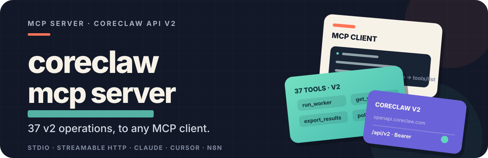

<p align="center">
  
</p>

CoreClaw MCP Server exposes the public CoreClaw OpenAPI v2 surface to MCP clients such as Codex, Claude Desktop, Cursor, n8n, and any client that supports stdio or Streamable HTTP MCP.

<p align="center">
  
</p>

## Hosted Endpoint

The first-class MCP entry point is the hosted Streamable HTTP endpoint:

```text
https://mcp.coreclaw.com/mcp
```

Use this config when the hosted deployment has been updated to this repository version:

```json
{
  "mcpServers": {
    "coreclaw": {
      "url": "https://mcp.coreclaw.com/mcp",
      "headers": {
        "api-key": "your-coreclaw-token"
      }
    }
  }
}
```

The server accepts `api-key`, `X-API-Key`, or `Authorization: Bearer <token>` from MCP clients and forwards CoreClaw API auth upstream as `Authorization: Bearer <token>`.

## Scope

<p align="center">
  
</p>

- API source of truth: `exported-api-docs/openapi.json` and `exported-api-docs/endpoints.csv`
- Public v2 operations exposed as MCP tools: 42 (39 OpenAPI operations + 3 orchestration tools: `poll_run`, `verify_run`, `run_workers_batch`; `get_worker_run_log` adds an optional in-process `grep` filter)
- Excluded internal operations: `POST /api/v2/workers/{workerId}/versions`, `PUT /api/v2/workers/{workerId}/versions/{version}`, `GET /api/v2/workers/{workerId}/internal`, `GET /api/v2/queued-worker-runs`
- Transports: stdio and Streamable HTTP
- REST compatibility shim: `POST /mcp/<tool_name>`
- Auth: incoming `api-key`, `X-API-Key`, or `Authorization: Bearer <token>` is forwarded to CoreClaw as `Authorization: Bearer <token>`
- Server instructions: returned during MCP `initialize` with the recommended CoreClaw workflow in English and Chinese
- Tool annotations: every tool exposes explicit `title`, `readOnlyHint`, `destructiveHint`, `idempotentHint`, and `openWorldHint`

## Pagination

CoreClaw's list endpoints (`list_store_workers`, `list_workers`, `list_worker_runs`, `list_worker_tasks`, `list_run_queue_items`, and the `list_*_results` tools) use **1-based page numbering**. `offset` is the page number, not a row skip count: `offset=1` returns page 1, `offset=2` returns page 2, and `offset=0` is accepted as page 1 (compat). `limit` is the page size (max 100). Out-of-range `offset` returns an empty list. The MCP layer passes `offset`/`limit` straight through to the upstream in a single GET — callers page by incrementing `offset` by 1.

`list_worker_runs` also accepts optional `start_time`/`end_time` query parameters (Unix seconds) to filter by `created_at`. Both must be provided together and must fall in the same calendar month; without them, only the current month's runs are returned.

## Build And Test

```bash
go test ./...
go vet ./...
go build -o coreclaw-mcp-server .
```

Real API and local HTTP verification:

```powershell
$env:CORECLAW_API_KEY="your-coreclaw-token"
.\scripts\verify-real-api.ps1
```

Real MCP-triggered end-to-end run verification:

```powershell
$env:CORECLAW_API_KEY="your-coreclaw-token"
.\scripts\verify-e2e-run.ps1
```

The E2E script starts the local Streamable HTTP MCP server, calls `run_worker_task` through MCP `tools/call`, polls `get_worker_run`, then verifies logs, result rows, and JSON export.

## Run

stdio:

```bash
CORECLAW_API_KEY="your-coreclaw-token" ./coreclaw-mcp-server --transport stdio
```

HTTP:

```bash
./coreclaw-mcp-server --transport http --port 3000 --base-url https://openapi.coreclaw.com
```

The HTTP server exposes:

- `POST /mcp` for MCP Streamable HTTP
- `POST /mcp/<tool_name>` for REST-style tool calls

## MCP Tools

Tools are registered in the same order a model should normally use them: discovery and preflight, execution, run lookup, result/log/export retrieval, then repeat or abort controls.

| Tool | API |
| --- | --- |
| `list_proxy_regions` | `GET /api/v2/proxy/region` |
| `list_store_workers` | `GET /api/v2/store` |
| `list_workers` | `GET /api/v2/workers` |
| `get_worker` | `GET /api/v2/workers/{workerId}` |
| `get_worker_input_schema` | `GET /api/v2/workers/{workerId}/input-schema` |
| `list_worker_tasks` | `GET /api/v2/worker-tasks` |
| `get_worker_task` | `GET /api/v2/worker-tasks/{workerTaskId}` |
| `get_worker_task_input` | `GET /api/v2/worker-tasks/{workerTaskId}/input` |
| `get_account_info` | `GET /api/v2/users/account` |
| `create_worker_task` | `POST /api/v2/worker-tasks` |
| `update_worker_task` | `PUT /api/v2/worker-tasks/{workerTaskId}` |
| `update_worker_task_input` | `PUT /api/v2/worker-tasks/{workerTaskId}/input` |
| `delete_worker_task` | `DELETE /api/v2/worker-tasks/{workerTaskId}` |
| `run_worker` | `POST /api/v2/workers/{workerId}/runs` |
| `run_worker_task` | `POST /api/v2/worker-tasks/{workerTaskId}/runs` |
| `run_workers_batch` | orchestration: per-item `POST /api/v2/workers/{workerId}/runs` + polling |
| `queue_worker_run` | `POST /api/v2/workers/{workerId}/queued-runs` |
| `list_run_queue_items` | `GET /api/v2/run-queue/items` |
| `activate_run_queue_items` | `POST /api/v2/run-queue/items/activate` |
| `release_run_queue_items` | `POST /api/v2/run-queue/items/release` |
| `release_run_queue_item` | `POST /api/v2/run-queue/items/{queueId}/release` |
| `list_worker_runs` | `GET /api/v2/worker-runs` |
| `get_last_worker_run` | `GET /api/v2/worker-runs/last` |
| `get_worker_run` | `GET /api/v2/worker-runs/{runId}` |
| `poll_run` | orchestration: `GET /api/v2/worker-runs/{runId}` until terminal |
| `verify_run` | orchestration: `get_worker_run` + `list_worker_run_results` + verdict |
| `get_worker_last_run` | `GET /api/v2/workers/{workerId}/runs/last` |
| `list_last_worker_run_results` | `GET /api/v2/worker-runs/last/result` |
| `export_last_worker_run_results` | `GET /api/v2/worker-runs/last/export` |
| `get_last_worker_run_log` | `GET /api/v2/worker-runs/last/log` |
| `list_worker_run_results` | `GET /api/v2/worker-runs/{runId}/result` |
| `export_worker_run_results` | `GET /api/v2/worker-runs/{runId}/result/export` |
| `get_worker_run_log` | `GET /api/v2/worker-runs/{runId}/log` (optional `grep` filters to error/traceback lines) |
| `list_worker_last_run_results` | `GET /api/v2/workers/{workerId}/runs/last/result` |
| `export_worker_last_run_results` | `GET /api/v2/workers/{workerId}/runs/last/export` |
| `get_worker_last_run_log` | `GET /api/v2/workers/{workerId}/runs/last/log` |
| `rerun_last_worker_run` | `POST /api/v2/worker-runs/last/rerun` |
| `rerun_worker_run` | `POST /api/v2/worker-runs/{runId}/rerun` |
| `rerun_worker_last_run` | `POST /api/v2/workers/{workerId}/runs/last/rerun` |
| `abort_last_worker_run` | `POST /api/v2/worker-runs/last/abort` |
| `abort_worker_run` | `POST /api/v2/worker-runs/{runId}/abort` |
| `abort_worker_last_run` | `POST /api/v2/workers/{workerId}/runs/last/abort` |

## Example MCP Config

Hosted HTTP:

```json
{
  "mcpServers": {
    "coreclaw": {
      "url": "https://mcp.coreclaw.com/mcp",
      "headers": {
        "api-key": "your-coreclaw-token"
      }
    }
  }
}
```

Local stdio:

```json
{
  "mcpServers": {
    "coreclaw": {
      "command": "/absolute/path/to/coreclaw-mcp-server",
      "args": ["--transport", "stdio", "--base-url", "https://openapi.coreclaw.com"],
      "env": {
        "CORECLAW_API_KEY": "your-coreclaw-token"
      }
    }
  }
}
```

Local HTTP:

```json
{
  "mcpServers": {
    "coreclaw": {
      "url": "http://localhost:3000/mcp",
      "headers": {
        "api-key": "your-coreclaw-token"
      }
    }
  }
}
```

## REST Shim Example

```bash
curl -X POST http://localhost:3000/mcp/list_store_workers \
  -H "Content-Type: application/json" \
  -d '{"keyword":"amazon","offset":1,"limit":5}'

curl -X POST http://localhost:3000/mcp/get_account_info \
  -H "Content-Type: application/json" \
  -H "api-key: your-coreclaw-token" \
  -d '{}'

curl -X POST http://localhost:3000/mcp/run_worker \
  -H "Content-Type: application/json" \
  -H "api-key: your-coreclaw-token" \
  -d '{"worker_id":"YOUR_WORKER_ID","version":"v1.0.1","input_json":"{\"keyword\":\"coffee\",\"limit\":10}","is_async":true}'
```

For `run_worker`, `queue_worker_run`, `create_worker_task`, and `update_worker_task_input`, pass business fields from `get_worker_input_schema` as `input_json`. The MCP server wraps that object as `input.parameters.custom` for CoreClaw. Advanced callers can pass a complete CoreClaw `input` object with `raw_input_json` instead (`run_worker` and `queue_worker_run` only).

## GitHub Deployment

The repository includes:

- `.github/workflows/ci.yml`: format, vet, race tests, build
- `.github/workflows/release.yml`: multi-platform artifacts
- `.github/workflows/deploy.yml`: manual SSH deployment to a Linux server

Recommended GitHub Secrets:

- `SSH_HOST`
- `SSH_USER`
- `SSH_PORT` (optional, defaults to `22`)
- `SSH_PASSWORD`
- `CORECLAW_BASE_URL` (optional, defaults to `https://openapi.coreclaw.com`)

Do not commit `.env`, API tokens, or server passwords.

---

<p align="center">
  
</p>
